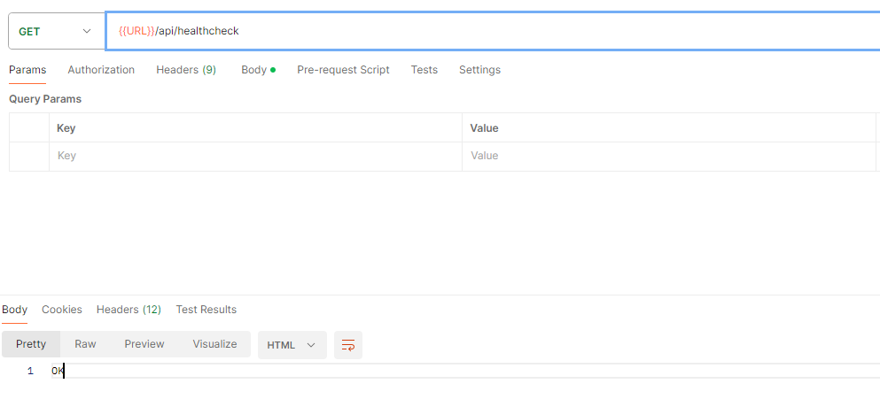
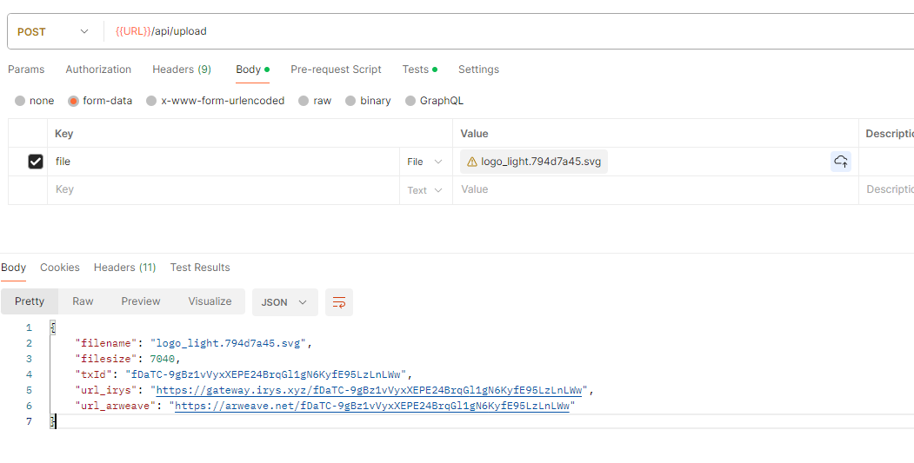
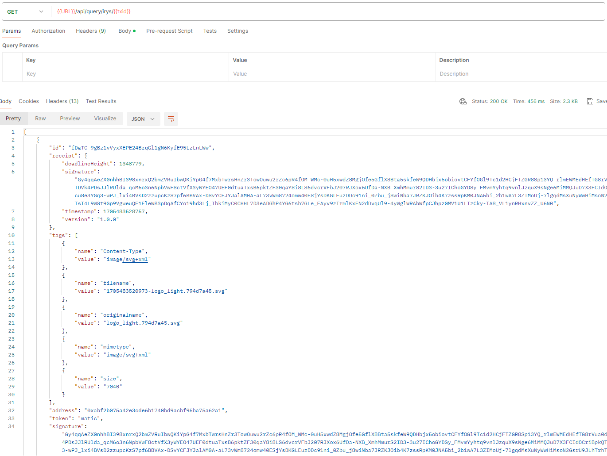

# irys-sdk-api-typescript

Irys, formerly known as Bundlr, is a provenance layer on Arweave. It scales uploads to Arweave via bundling, lets you pay with different tokens than AR, and gives you strong provenance capabilities for your uploads.

## Prerequisite

```bash
npm init -y
npx tsc --init
npm install express multer dotenv
npm install @irys/sdk @irys/query
npm install --save-dev typescript @types/express @types/multer ts-node ts-node-dev @types/node nodemon @types/dotenv
```

## Run locally

Note: Make sure to set environment variable 'PRIVATE_KEY' with wallet private key.

```
npm run start
OR
npm run start:dev
```

## Vercel deplotment

```
npm run build
# commit and push the generated dist folder
```

## Vercel URL

https://irys-sdk-api-typescript.vercel.app

## APIs

### GET /api/healthcheck

/api/healthcheck


### POST /api/upload



### GET /api/query/irys/`<txid>`


